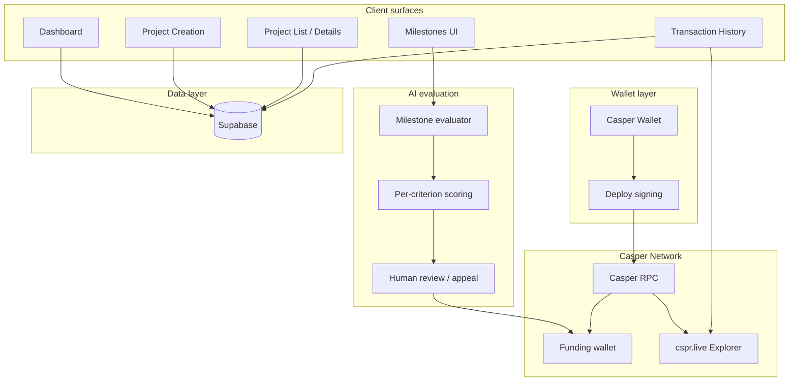

# Verdikt

**Fund with proof, not promises.**

Verdikt is an AI-powered, milestone-based crowdfunding protocol built on the 
Casper Network. Project creators launch funding campaigns broken into 
milestones; the community funds them in CSPR; and an AI evaluator reviews 
milestone submissions before funds are released — with a human reviewer 
always in the loop.

## Overview

| Layer | Purpose |
|---|---|
| Create | Project creation with funding target, description, and milestone breakdown |
| Fund | Community funds projects in CSPR via Casper Wallet |
| Evaluate | AI scores milestone submissions against Innovation, Feasibility, Impact, Clarity |
| Review | Human reviewer confirms or appeals the AI's recommendation before release |
| Release | Funds move from the project's funding wallet only on milestone approval |

## Architecture



**Tech stack**

| Component | Technology |
|---|---|
| Frontend | React, Vite, Tailwind CSS |
| Backend | Supabase |
| Blockchain | Casper Network (Testnet), Casper Wallet, Casper JS SDK |
| AI | LLM-based milestone scoring (Groq) |

## System topics

### Dashboard
Landing surface for creators and funders. Surfaces active projects, funding 
progress, and recent activity at a glance.

### Project Creation
Define a project's title, description, funding target (CSPR), and milestone 
breakdown before launch.

### Project List / Details
Browse active projects and drill into a single project's funding progress, 
milestones, and evaluation history.

### Milestones & AI Evaluation
Per-milestone submission and scoring: Innovation, Feasibility, Impact, and 
Clarity, each with a criterion-level explanation of the score.

### Human Review / Appeal
The AI's evaluation is a recommendation, not a verdict. A human reviewer 
confirms release or triggers an appeal if the AI's call looks wrong.

### Transaction History & Explorer Links
Every funding deploy and milestone release is traceable back to its Casper 
Testnet transaction via cspr.live.

## Signature mechanics

### Milestone-Gated Funding
Funds sit in the project's funding wallet and release only when a milestone 
is approved. Funding flows from the funder's wallet to the project's stored 
funding wallet, never to a static address.

### AI Evaluation, Human Authority
Every milestone gets a score and a plain-language breakdown per criterion. 
The AI never has final authority — a human reviewer approves, rejects, or 
overrides.

### Explainable Scoring
Scores are broken down by criterion (Innovation, Feasibility, Impact, 
Clarity) so funders and creators can see exactly what drove a result.

### On-Chain Verification
Every deploy is signed via Casper Wallet and submitted to Casper Testnet, 
with a direct explorer link for independent verification.

## Platform principles

- Casper Network only — no MetaMask, ethers.js, wagmi, WalletConnect, viem
- Wallet connection fails gracefully if Casper Wallet isn't installed
- Funding recipient always comes from the project record, never a hardcoded 
  env variable
- AI evaluation is advisory; a human makes the release decision
- Every transaction is verifiable on-chain via explorer links

## Getting started

### Prerequisites
- Node.js 18+
- Casper Wallet browser extension
- Supabase project
- Groq API key (for AI evaluation)

### Frontend
```bash
git clone https://github.com/jeevansridharan/verdikt.git
cd verdikt
npm install
cp .env.example .env
npm run dev
```

### Database
1. Create a project at supabase.com
2. Run the SQL migrations in order
3. Copy credentials into .env

## Demo flow

1. Dashboard — protocol activity at a glance
2. Create a project — set funding target and milestones
3. Connect Casper Wallet — account detection and balance
4. Fund the project — CSPR moves to the project's funding wallet
5. Submit a milestone — creator provides proof of progress
6. AI evaluation — per-criterion score and explanation
7. Human review — confirm or appeal the AI's call
8. Release — funds move on approval
9. Explorer verification — confirm the deploy on cspr.live
10. Transaction history — full audit trail in-app

## Roadmap

- Escrow smart contract for funding (currently direct-to-wallet for demo)
- Community-defined scoring criteria via governance
- Expanded appeal workflow with reviewer notes

## License

MIT License — see LICENSE for details.
